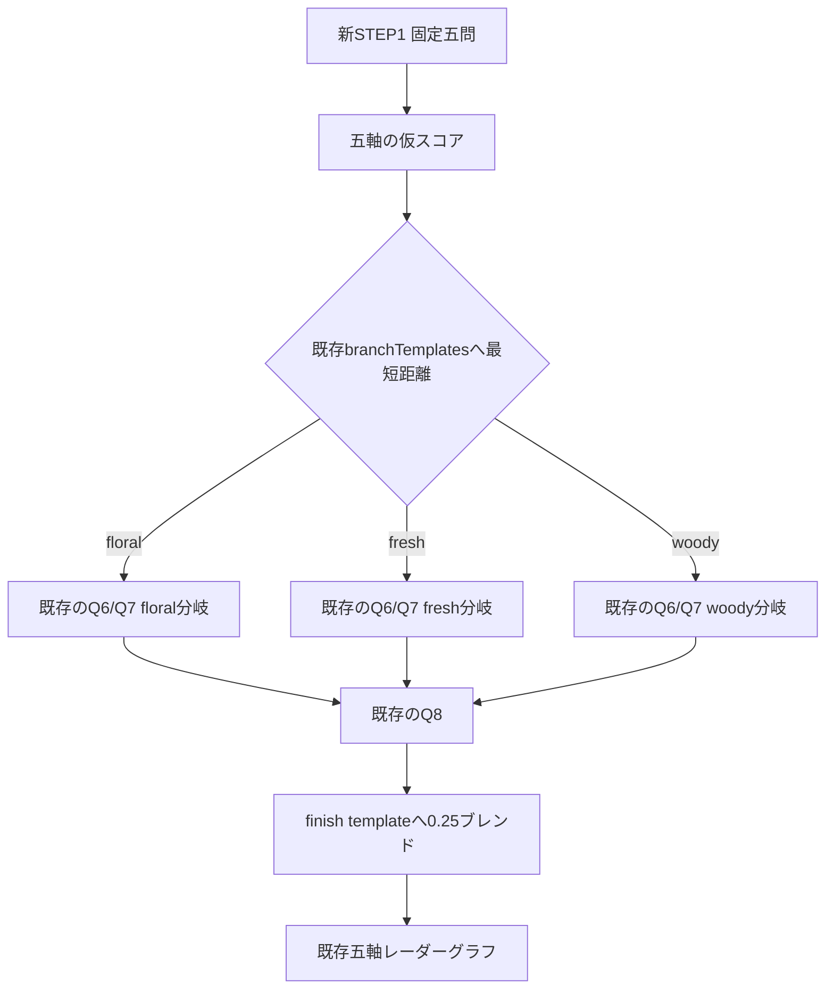
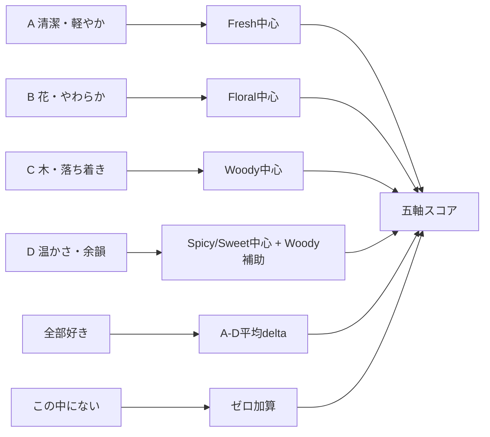
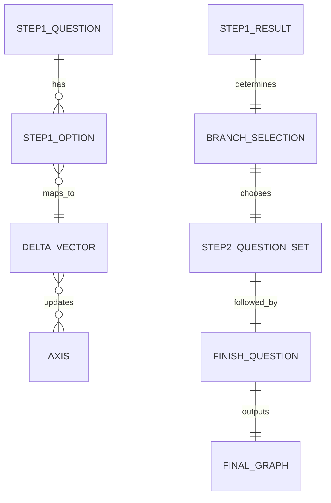

# fragrance_questionnaire 通常設問再設計レポート

## エグゼクティブサマリー

本リポジトリは、香りワークショップ向けの静的 HTML ベース試作であり、`customer/questionnaire.html`、`customer/questionnaire_step2.html`、`customer/fragrance-graph.html` を中心に、アンケートから五軸グラフ、予約、管理画面までをつないでいます。既存の `deep-research-report.md` は、五軸を **floral / fresh / woody / spicy / sweet** と定義し、初期値 50、STEP1 の重み 1、STEP2 の重み 2、Q8 の重み 3、最後に finish template へ 0.25 ブレンドして clamp する現行ロジックを前提にしています。したがって、今回の最適解は**分岐やグラフの器は変えず、STEP1 固定五問だけを作り直す**ことです。citeturn39view0turn40view0turn32view0

提案の核心は三つです。第一に、現行の「色」と「音楽」は、匂いとの対応がまったく無根拠ではないものの、香り選好の**直接測定**ではなく、色や音への**二次的な連想**に依存します。色と匂いの対応、音と匂いの対応は実験的に一貫性を示しますが、その対応は pleasantness や complexity のような心理次元にも左右されます。第二に、調査票設計の原則として、質問は短く、具体的で、曖昧語を避け、回答者が正確に答えられる文脈を持つべきです。第三に、選択肢は多すぎると迷いを増やしますが、**六択は「五〜七択が選びやすい」という実務指針の範囲内**です。以上から、STEP1 は「香り立ち」「使用場面」「甘さ・温度感」「残り方」「対人印象」という**香りに近い判断軸**へ置き換えるのが最も妥当です。citeturn37view0turn36view0turn34view2turn35view0

本報告の提案では、各設問の選択肢を **A=清潔・軽やか、B=花・やわらか、C=木・落ち着き、D=温かさ・余韻、全部好き、この中にない** の六択に統一します。ここで **D は新しい分岐軸ではなく、Spicy/Sweet を強めつつ Woody を補助的に上げるファセット**として設計し、既存の floral / fresh / woody の三分岐へ自然に吸収させます。これにより、ユーザー要件である「四パターン化」と「分岐テンプレート据え置き」を両立できます。citeturn32view0

## 現状把握と再設計方針

現行構成では、STEP1 に共通五問、STEP2 に分岐二問、最後に共通の仕上がり一問があり、グラフ画面では五軸のレーダー表示とスライダー微調整を行う構造です。README のページ構成でも `questionnaire.html`、`questionnaire_step2.html`、`fragrance-graph.html` が主要ページとして明示されており、既存レポートは STEP1 の各設問 delta、STEP2 の分岐 delta、Q8 delta、finish template をすでに具体値で定義しています。つまり、**今回触るべき範囲は STEP1 の設問文・選択肢・step1ScoreMap に限定するのが最小変更**です。citeturn39view0turn39view1turn32view0

五軸名はリポジトリ側ですでに十分に定義されています。既存レポートは floral を花のブーケ感、fresh をシトラス／ウォーター／グリーン系の清潔感とみずみずしさ、woody を木質の落ち着き、spicy を温かい刺激、sweet を甘さとやわらかな余韻として説明しています。さらに、entity["organization","日本香料工業会","fragrance industry japan"] の香調分類でも、シトラス、フローラル、ウッディ、オリエンタル系が香りの大きな骨格として整理されており、repo の five-axis は業界用語として無理のない整理です。今回の再設計では、この既存五軸をそのまま使います。citeturn40view0turn33view0

設問設計の原則としては、entity["organization","Government Analysis Function","uk civil service"] が「短く、明確で、曖昧語を避け、文脈を与える」ことを推奨し、entity["company","マクロミル","market research japan"] も「いつ・どこで・何を・どのように」の具体表現と、五〜七個程度の選択肢数を勧めています。したがって、象徴的な代理指標ではなく、**香りをまとった時の具体的な体験**を問う形へ寄せることが、回答しやすさと配点の説明可能性の両面で有利です。citeturn34view2turn35view0

色や音の質問を完全否定する必要はありません。現行レポートが採用しているように、色と匂い、音と匂いのクロスモーダル対応には実証研究があります。ただし、その対応は「無作為ではない」ことを示すものであって、**個人の香り選好を直接当てる主設問**として最適であることまでは意味しません。実際、音と匂いの研究では pleasantness と complexity がピッチ対応に関与し、色と匂いの研究でも対応は systematic だが smell preference そのものとは別概念です。よって、色・音のような象徴変数は補助情報としては有効でも、STEP1 の中心設問としては一段弱いと判断しました。citeturn37view0turn36view0turn32view0

このフローで重要なのは、**新しい D 選択肢を追加しても、branch key 自体は増やさない**ことです。D は warm/deep 系ファセットとして spicy と sweet を増やしつつ woody を少し支えるため、既存三分岐の距離計算にそのまま入れられます。citeturn32view0

## 比較表

以下の比較表では、**現行配点**は既存 `deep-research-report.md` 記載の STEP1 delta を基準に整理し、**現行の完全文言**は `customer/questionnaire.html` のソースを直接確認して補っています。GitHub の閲覧 UI では当該コード行の安定参照が難しかったため、表中の現行文言はソース抽出値、現行配点は既存レポート準拠として示します。提案配点は同じ五軸・同じ STEP1 重み 1 を守ったうえで再設計したものです。表中の配点順は **[Floral, Fresh, Woody, Spicy, Sweet]** です。citeturn32view0turn39view1

**比較表 A**

| 版 | 設問文 | 選択肢 | 配点 |
|---|---|---|---|
| 現行 | 今いちばん惹かれる香りは？ | A 花がふわっと香る B みずみずしく爽やか C 木や森の落ち着き D なし 全部好き この中にはない | A (+8,+1,-2,-1,+2) B (+1,+8,-2,-1,0) C (-2,-2,+8,+2,-1) D — 全部好き (+2,+2,+1,0,0) この中にはない (0,0,0,0,0) |
| 提案 | 最初の香り立ちとして、いちばん心地よいのはどれですか？ | A せっけんや水のようにみずみずしい B 白い花がふわっとやわらかい C 木や葉のように静かで落ち着く D 紅茶やスパイスのように温かく印象に残る 全部好き この中にない | A (+1,+8,-2,-2,0) B (+8,+1,-2,-1,+2) C (-2,-1,+8,+2,-1) D (0,-1,+1,+4,+4) 全部好き (+2,+2,+1,+1,+1) この中にない (0,0,0,0,0) |

**比較表 B**

| 版 | 設問文 | 選択肢 | 配点 |
|---|---|---|---|
| 現行 | 好きな色は何ですか？ | A やさしいピンク・ベージュ B 白・水色・透明感 C ブラウン・深いグリーン D なし 全部好き この中にはない | A (+5,+1,-1,-1,+3) B (+1,+5,-1,-1,-1) C (-1,-1,+5,+1,0) D — 全部好き (+2,+2,+1,0,+1) この中にはない (0,0,0,0,0) |
| 提案 | どんな場面で使いやすいと感じますか？ | A 朝の外出や仕事前に、清潔に整う B 人と近い距離で、やさしく上品に見せたい C 一人時間や読書のときに、静かに落ち着きたい D 夜や特別な時間に、少し色気や深みがほしい 全部好き この中にない | A (0,+5,0,-1,-1) B (+4,+1,0,-1,+2) C (0,-1,+4,+1,0) D (+1,-2,+1,+3,+3) 全部好き (+1,+1,+1,+1,+1) この中にない (0,0,0,0,0) |

**比較表 C**

| 版 | 設問文 | 選択肢 | 配点 |
|---|---|---|---|
| 現行 | どんな気分になりたいですか？ | A やさしく癒やされたい B すっきり切り替えたい C 自分らしさを出したい D なし 全部好き この中にはない | A (+4,+1,0,-1,+3) B (0,+5,0,+1,-2) C (0,-1,+4,+2,0) D — 全部好き (+1,+2,+1,+1,0) この中にはない (0,0,0,0,0) |
| 提案 | 香りの甘さや温度感は、どれがちょうどいいですか？ | A 甘さは少なく、さらっと涼しい B 花の蜜のように、やさしくほのか C 木や樹脂のように、まろやかで落ち着く D バニラやスパイスのように、温かくしっかり 全部好き この中にない | A (0,+4,-1,0,-3) B (+4,+1,0,-1,+2) C (0,-1,+4,+1,+1) D (0,-2,+1,+3,+4) 全部好き (+1,+1,+1,+1,+1) この中にない (0,0,0,0,0) |

**比較表 D**

| 版 | 設問文 | 選択肢 | 配点 |
|---|---|---|---|
| 現行 | どんな時に使いたいですか？ | A 休日に気分を上げたい B 仕事や外出で心地よく整えたい C 夜や特別な時間を深く楽しみたい D なし 全部好き この中にはない | A (+2,+2,-1,0,+3) B (+1,+3,+1,-1,-1) C (0,-2,+3,+3,+2) D — 全部好き (+1,+1,+1,+1,+1) この中にはない (0,0,0,0,0) |
| 提案 | 香りの残り方は、どれが心地よいですか？ | A つけたてにすっと広がって、軽く引く B 近づいたときにふんわり感じる C 静かに落ち着いて、長めに続く D 後半にぬくもりや深みが出てくる 全部好き この中にない | A (0,+4,-1,-1,-1) B (+3,+1,0,-1,+2) C (0,0,+4,+1,0) D (0,-1,+2,+3,+2) 全部好き (+1,+1,+1,+1,+1) この中にない (0,0,0,0,0) |

**比較表 E**

| 版 | 設問文 | 選択肢 | 配点 |
|---|---|---|---|
| 現行 | 好きな音楽は何ですか？ | A 明るいポップ B 心にしみるストリングス C 自然に耳に残るクラシック D なし 全部好き この中にはない | A (+1,+3,-1,0,+2) B (+2,+1,+1,0,+2) C (0,0,+3,+1,-1) D — 全部好き (+1,+1,+1,0,+1) この中にはない (0,0,0,0,0) |
| 提案 | 会った人に、香りでどんな印象が伝わるとしっくりきますか？ | A 清潔で軽やか、話しかけやすい B やわらかく上品で、親しみやすい C 落ち着いて知的で、安心感がある D 印象に残る、あたたかい余韻がある 全部好き この中にない | A (0,+4,0,0,-1) B (+4,+1,0,-1,+2) C (0,0,+4,+1,0) D (+1,-1,+1,+2,+3) 全部好き (+1,+1,+1,+1,+1) この中にない (0,0,0,0,0) |

この比較で重要なのは、提案版がすべて **「香りに近い判断」→「軸へ直接配点」** になっていることです。現行の色・音楽はクロスモーダル連想としては成立しますが、提案版ではその間接性を外し、使う場面・甘さ・残り方・対人印象という実際のフレグランス選択に近い変数へ置き換えています。これにより、「その質問でその配点になる理由」が説明しやすくなります。citeturn37view0turn36view0turn34view2turn35view0

## 提案する通常設問

以下が、実際に STEP1 の固定五問として採用する最終文言です。A〜D の意味を全問でなるべく揃え、**A=清潔・軽やか、B=花・やわらか、C=木・落ち着き、D=温かさ・余韻** という学習しやすい並びにしています。これは回答者が毎回選択肢の意味を再学習しなくて済むようにするためで、質問の理解負荷を下げます。citeturn34view2turn35view0

**質問一**  
最初の香り立ちとして、いちばん心地よいのはどれですか？

A. せっけんや水のようにみずみずしい  
B. 白い花がふわっとやわらかい  
C. 木や葉のように静かで落ち着く  
D. 紅茶やスパイスのように温かく印象に残る  
全部好き  
この中にない

**質問二**  
どんな場面で使いやすいと感じますか？

A. 朝の外出や仕事前に、清潔に整う  
B. 人と近い距離で、やさしく上品に見せたい  
C. 一人時間や読書のときに、静かに落ち着きたい  
D. 夜や特別な時間に、少し色気や深みがほしい  
全部好き  
この中にない

**質問三**  
香りの甘さや温度感は、どれがちょうどいいですか？

A. 甘さは少なく、さらっと涼しい  
B. 花の蜜のように、やさしくほのか  
C. 木や樹脂のように、まろやかで落ち着く  
D. バニラやスパイスのように、温かくしっかり  
全部好き  
この中にない

**質問四**  
香りの残り方は、どれが心地よいですか？

A. つけたてにすっと広がって、軽く引く  
B. 近づいたときにふんわり感じる  
C. 静かに落ち着いて、長めに続く  
D. 後半にぬくもりや深みが出てくる  
全部好き  
この中にない

**質問五**  
会った人に、香りでどんな印象が伝わるとしっくりきますか？

A. 清潔で軽やか、話しかけやすい  
B. やわらかく上品で、親しみやすい  
C. 落ち着いて知的で、安心感がある  
D. 印象に残る、あたたかい余韻がある  
全部好き  
この中にない

この五問は、香りを「何の象徴に見えるか」ではなく、「どう香ってほしいか」「どう使いたいか」「どう残ってほしいか」で訊いています。既存レポートが採っていた色・音の科学的根拠は尊重しつつ、STEP1 の主タスクを**直接的な香り嗜好の把握**に寄せた、という位置づけです。citeturn32view0turn37view0turn36view0

## スコアからグラフへの変換

現行ロジックは維持します。すなわち、グラフ表示は「合計を 100 に揃えてから描く」のではなく、**各軸を 0〜100 の絶対値としてそのままレーダー表示**します。正規化が必要なのは、既存レポートが述べるように、原料プロファイルとの比較や距離計算を別用途で行う場合です。グラフ自体は既存の五軸レーダーとスライダー構造をそのまま使えます。citeturn12view0turn32view0turn40view0

スコア計算式は以下で十分です。

\[
\text{step1Axis} = \mathrm{clamp}\left(50 + \sum_{q=1}^{5}\Delta_q\right)
\]

\[
\text{branch} = \arg\min_{b \in \{floral,fresh,woody\}} \sum_{a} w_a \cdot \left| \text{step1Axis}_a - \text{branchTemplate}_{b,a} \right|
\]

\[
\text{step2Axis} = \mathrm{clamp}\left(\text{step1Axis} + 2\Delta_{Q6} + 2\Delta_{Q7}\right)
\]

\[
\text{preblendAxis} = \mathrm{clamp}\left(\text{step2Axis} + 3\Delta_{Q8}\right)
\]

\[
\text{finalAxis} = \mathrm{clamp}\left(\mathrm{round}(0.75 \cdot \text{preblendAxis} + 0.25 \cdot \text{finishTemplate})\right)
\]

新設するルールは二つだけです。**全部好き = A〜D の平均を四捨五入した delta**、**この中にない = (0,0,0,0,0)** です。これは既存レポートが採っている ALL/NONE の考え方と整合します。citeturn40view0turn32view0

グラフの読み取り閾値は、現行の初期値 50 を中立点として以下のように置くと運用しやすいです。これは**表示解釈の閾値**であり、スコア計算式そのものを変えるものではありません。

| 軸スコア | 解釈 | 実務上の意味 |
|---:|---|---|
| 0〜44 | 抑えめ | 原料選定では補助的に扱う |
| 45〜54 | やや控えめ〜中立 | 他軸を支える背景成分 |
| 55〜69 | 明確 | 好みとして見え始める主成分候補 |
| 70〜84 | 強い | 提案の骨格として優先する |
| 85〜100 | 非常に強い | その人の中心的な香り印象 |

また、原料マッチングを別途行う場合に限り、既存レポートに合わせて次の正規化を併用できます。

| 用途 | 処理 |
|---|---|
| レーダーグラフ表示 | 正規化しない。0〜100 をそのまま描画 |
| 原料プロファイル比較 | `axis / sum(axis) * 100` で合計 100 に正規化 |

この「グラフは絶対値、原料比較は合計 100 正規化」という二層構造にすると、既存 UX を壊さずに、原料選定ロジックだけ精密化できます。citeturn32view0

## スコア計算例

以下は、提案した新 STEP1 と、既存の fresh 分岐・既存 Q8 を組み合わせたサンプルです。回答者は「軽く清潔だが、少しやさしさも欲しい」タイプを想定しています。

| 段階 | 選択 | 加算 delta | 軸スコア 花/爽/木/辛/甘 |
|---|---|---|---|
| 初期値 | — | — | 50 / 50 / 50 / 50 / 50 |
| 質問一 | A せっけんや水のようにみずみずしい | (+1,+8,-2,-2,0) | 51 / 58 / 48 / 48 / 50 |
| 質問二 | A 朝の外出や仕事前に、清潔に整う | (0,+5,0,-1,-1) | 51 / 63 / 48 / 47 / 49 |
| 質問三 | B 花の蜜のように、やさしくほのか | (+4,+1,0,-1,+2) | 55 / 64 / 48 / 46 / 51 |
| 質問四 | A つけたてにすっと広がって、軽く引く | (0,+4,-1,-1,-1) | 55 / 68 / 47 / 45 / 50 |
| 質問五 | A 清潔で軽やか、話しかけやすい | (0,+4,0,0,-1) | 55 / 72 / 47 / 45 / 49 |

この STEP1 結果 `55 / 72 / 47 / 45 / 49` は、既存 branch template との重み付き距離で **fresh 分岐**が最短になります。ここから既存の fresh 分岐質問をそのまま適用します。citeturn32view0

| 段階 | 選択 | 既存ロジック上の加算 | 軸スコア 花/爽/木/辛/甘 |
|---|---|---|---|
| 既存Q6 | B 清潔感がある | 2 × (0,+4,0,-1,+1) | 55 / 80 / 47 / 43 / 51 |
| 既存Q7 | A 朝の空気みたいにすっきり | 2 × (0,+5,0,0,-1) | 55 / 90 / 47 / 43 / 49 |
| 既存Q8 | A 軽やかにまとめたい | 3 × (+1,+4,-2,-2,-1) | 58 / 100 / 41 / 37 / 46 |
| finish | A template を 0.25 ブレンド | `round(0.75*preblend + 0.25*templateA)` | **55 / 94 / 40 / 34 / 42** |

したがって、このサンプル回答者の最終グラフは **Floral 55 / Fresh 94 / Woody 40 / Spicy 34 / Sweet 42** になります。グラフ解釈としては「フレッシュが主役、フローラルは補助的に明確、その他は抑えめ」です。既存のグラフページは五軸レーダーとスライダー微調整を前提としているため、この出力はそのまま既存ページに流し込めます。citeturn12view0turn32view0

なお、もしこの最終値を原料検索用に合計 100 へ正規化するなら、総和 265 なので、おおよそ **20.8 / 35.5 / 15.1 / 12.8 / 15.8** になります。これは表示のためではなく、既存レポートが想定する原料プロファイルとの距離比較に使う補助値です。citeturn32view0

## 分岐統合と実装互換性

分岐質問と最後の質問は、ユーザー要件どおり**文言も scoring も変更しません**。STEP2 側はすでに route 別の Q6/Q7 と共通 Q8 を持っており、既存レポートはそれぞれの delta を fixed value として定義しています。したがって、新設計で変わるのは **STEP1 の入力精度**だけで、STEP2 以降のロジックは既存資産をそのまま再利用できます。citeturn11view3turn32view0

分岐統合は次の形になります。

| 既存分岐 | 既存Q6 | 既存Q7 | 共通Q8 |
|---|---|---|---|
| floral | 身につけた時の印象は？ | 甘さの出方はどれが近いですか？ | 今日の仕上がりでいちばん近いのは？ |
| fresh | どんな抜け感が好きですか？ | 香りの印象はどれが近いですか？ | 今日の仕上がりでいちばん近いのは？ |
| woody | 深みの方向はどれが好きですか？ | 余韻はどう残ってほしいですか？ | 今日の仕上がりでいちばん近いのは？ |

ここで新しい D 選択肢は、branch key を増やしません。D を「温かさ・余韻」ファセットとして Spicy/Sweet 高め、Woody 補助で設計しているので、**floral / fresh / woody のいずれかへ距離的に落ちる**ようになっています。これが、分岐テンプレートを変えずに四パターン化するための最重要ポイントです。citeturn32view0

実装互換性の観点では、変更点は次の理解で十分です。`questionnaire.html` の STEP1 `questions` 配列を五問とも新文言へ差し替え、各設問に D を追加し、`step1ScoreMap` に A/B/C/D/ALL/NONE を入れるだけで、`axisOrder`、`questionWeights`、`branchTemplates`、`step2ScoreMap`、`q8ScoreMap`、`finishTemplates`、および最終グラフ出力構造は据え置けます。sessionStorage 側の shape も、回答 key が A/B/C/ALL/NONE から A/B/C/D/ALL/NONE に増えるだけで壊れません。citeturn39view1turn40view0turn32view0

最後に前提を明示します。現行 STEP1 の**完全文言**は `customer/questionnaire.html` のソースを直接確認して補っており、既存 `deep-research-report.md` は現行質問の**配点と短縮ラベル**を示す資料として扱いました。したがって、「score の現行値」と「再設計の根拠」は既存レポートと整合しつつ、文言比較だけは `questionnaire.html` を source of truth とした整理です。この前提のもとでは、本報告の提案は repo の現行構造に対して最も低リスクで、かつユーザー要件に最も忠実な STEP1 再設計案です。citeturn32view0turn39view1